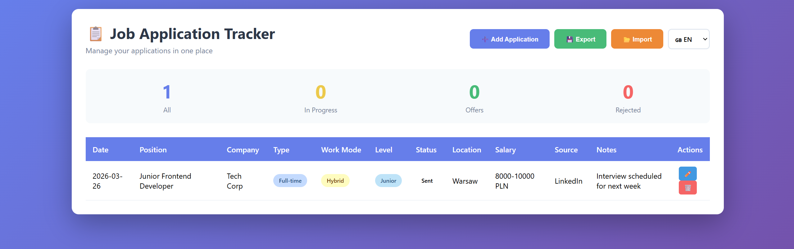

# 📋 Job Application Tracker v2.5

**Job Application Tracker** is a professional, lightweight web tool designed to streamline the recruitment process. It replaces messy spreadsheets with a clean, interactive dashboard, allowing candidates to manage their career path with ease.

---

## 📷 Application Preview

*(Full-page screenshot showcasing the multi-language dashboard and recruitment table)*

---

## 🚀 Key Features

* **Interactive Dashboard:** Real-time stats (All, In Progress, Offers, Rejected) updated as you type.
* **Full CRUD Functionality:** Easily Create, Read, Update, and Delete job applications.
* **Smart Location Input:** A hybrid input system that provides city suggestions (Warsaw, Cracow, etc.) while allowing users to type in any custom location.
* **Multi-language Support (i18n):** Instant interface switching between **Polish (PL)**, **English (EN)**, and **German (DE)**.
* **Data Persistence:** Uses `localStorage` to keep your data safe in your browser—no backend or login required.
* **Data Portability:**
    * **Export to CSV:** Back up your data for Excel or Google Sheets.
    * **Import from CSV:** Restore your list or migrate data between devices.

---

## 🛠️ Technical Architecture

This project follows the **Separation of Concerns (SoC)** principle:

* **Presentation (`index.html`):** Semantic structure with dynamic `datalist` for location suggestions.
* **Styling (`style.css`):** Modern UI built with CSS Grid, Flexbox, and custom badges for status types.
* **Logic (`script.js`):** Vanilla JavaScript engine handling internationalization, CSV parsing, and state management.

---

## 📖 How to Use

### 🌐 Live Version
Access the app directly at: **[https://koziolbartosz777.github.io/Job-Application-Tracker/](https://koziolbartosz777.github.io/Job-Application-Tracker/)**

### 💻 Local Setup
1. Clone the repo: `git clone https://github.com/koziolbartosz777/Job-Application-Tracker.git`
2. Open `index.html` in your browser.

---

## 👤 Author

**Bartosz Kozioł** 

